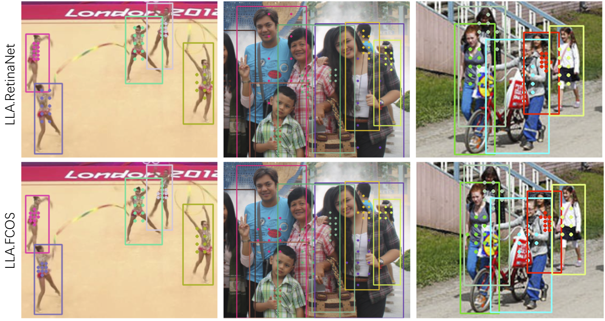

# LLA: Loss-aware Label Assignment for Dense Pedestrian Detection


This project provides an implementation for "[LLA: Loss-aware Label Assignment for Dense Pedestrian Detection](https://arxiv.org/abs/2101.04307)" on PyTorch. **LLA is the first one-stage detector that surpass two-stage detector (Faster R-CNN) on CrowdHuman dataset**.

Experiments in the paper were conducted on the internal framework, thus we reimplement them on [cvpods](https://github.com/Megvii-BaseDetection/cvpods) and report details as below.



## Requirements
* [cvpods](https://github.com/Megvii-BaseDetection/cvpods)
* scipy >= 1.5.4

## Get Started

* install cvpods locally (requires cuda to compile)
```shell

python3 -m pip install 'git+https://github.com/Megvii-BaseDetection/cvpods.git'
# (add --user if you don't have permission)

# Or, to install it from a local clone:
git clone https://github.com/Megvii-BaseDetection/cvpods.git
python3 -m pip install -e cvpods

# Or,
pip install -r requirements.txt
python3 setup.py build develop
```

* prepare datasets
```shell
cd /path/to/cvpods/datasets
ln -s /path/to/your/crowdhuman/dataset crowdhuman
```

* Train & Test
```shell
git clone https://github.com/Megvii-BaseDetection/LLA.git
cd LLA/playground/detection/crowdhuman/lla.res50.fpn.crowdhuman.800size.30k  # for example

# Train
pods_train --num-gpus 8

# Test
pods_test --num-gpus 8 \
    MODEL.WEIGHTS /path/to/your/save_dir/ckpt.pth # optional
    OUTPUT_DIR /path/to/your/save_dir # optional

# Multi node training
## sudo apt install net-tools ifconfig
pods_train --num-gpus 8 --num-machines N --machine-rank 0/1/.../N-1 --dist-url "tcp://MASTER_IP:port"

```

## Results on CrowdHuman val set

| model | Backbone | lr sched. | Aux Branch | MR | AP50 |  Recall | download |
|:------| :----:   | :----: |:---:| :---:| :---:| :---: | :--------: |
|  FCOS | Res50   | 30k       | CenterNess | -     | -       | -    | weights |
|  ATSS | Res50   | 30k       | CenterNess | -     | -       | -    | weights |
| [Faster R-CNN](https://github.com/Megvii-BaseDetection/cvpods/tree/master/playground/detection/crowdhuman/rcnn/faster_rcnn.res50.fpn.crowdhuman.800size.1x) | Res50  | 30k | -       |  -         |   -    | -       |  weights    |
| [LLA.FCOS](https://github.com/Joker316701882/LLA/tree/main/playground/detection/crowdhuman/lla.res50.fpn.crowdhuman.800size.30k) | Res50 | 30k       | IoU        | 47.5  | 88.2    | 94.4 | [weights](https://megvii-my.sharepoint.cn/:u:/g/personal/gezheng_megvii_com/EdVJdAm0RINGnS5LoroQ2eUBg-Gwcaf7sbSl7eu7QX35rw) |
| LLA.FCOS | Res101 | 30k       | IoU        | - | -   | - | weights |

## Acknowledgement
This repo is developed based on cvpods. Please check [cvpods](https://github.com/Megvii-BaseDetection/cvpods) for more details and features.

## License
This repo is released under the Apache 2.0 license. Please see the LICENSE file for more information.

## Citing
If you use this work in your research or wish to refer to the baseline results published here, please use the following BibTeX entries:
```
@article{ge2021lla,
  title={LLA: Loss-aware Label Assignment for Dense Pedestrian Detection},
  author={Ge, Zheng and Wang, Jianfeng and Huang, Xin and Liu, Songtao and Yoshie, Osamu},
  journal={arXiv preprint arXiv:2101.04307},
  year={2021}
}
```
